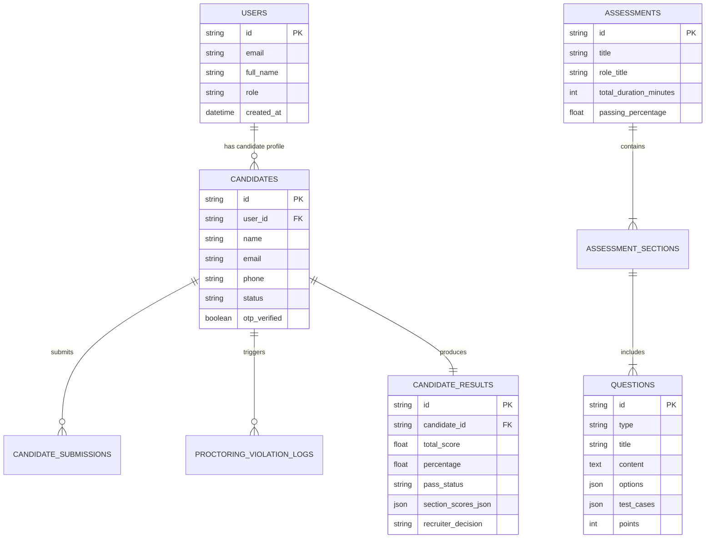

# Database ER Diagram & Schema Specifications

```mermaid
erDiagram
    USERS ||--o{ CANDIDATES : "has candidate profile"
    ASSESSMENTS ||--|{ ASSESSMENT_SECTIONS : "contains"
    ASSESSMENT_SECTIONS ||--|{ QUESTIONS : "includes"
    CANDIDATES ||--o{ CANDIDATE_SUBMISSIONS : "submits"
    CANDIDATES ||--o{ PROCTORING_VIOLATION_LOGS : "triggers"
    CANDIDATES ||--|| CANDIDATE_RESULTS : "produces"

    USERS {
        string id PK
        string email
        string full_name
        string role
        datetime created_at
    }

    CANDIDATES {
        string id PK
        string user_id FK
        string name
        string email
        string phone
        string status
        boolean otp_verified
    }

    ASSESSMENTS {
        string id PK
        string title
        string role_title
        int total_duration_minutes
        float passing_percentage
    }

    QUESTIONS {
        string id PK
        string type
        string title
        text content
        json options
        json test_cases
        int points
    }

    CANDIDATE_RESULTS {
        string id PK
        string candidate_id FK
        float total_score
        float percentage
        string pass_status
        json section_scores_json
        string recruiter_decision
    }
```
